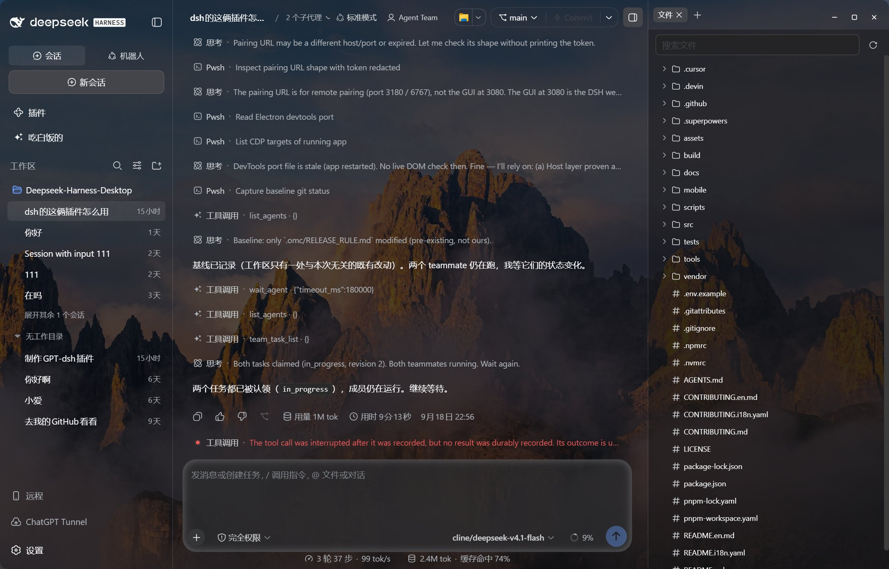
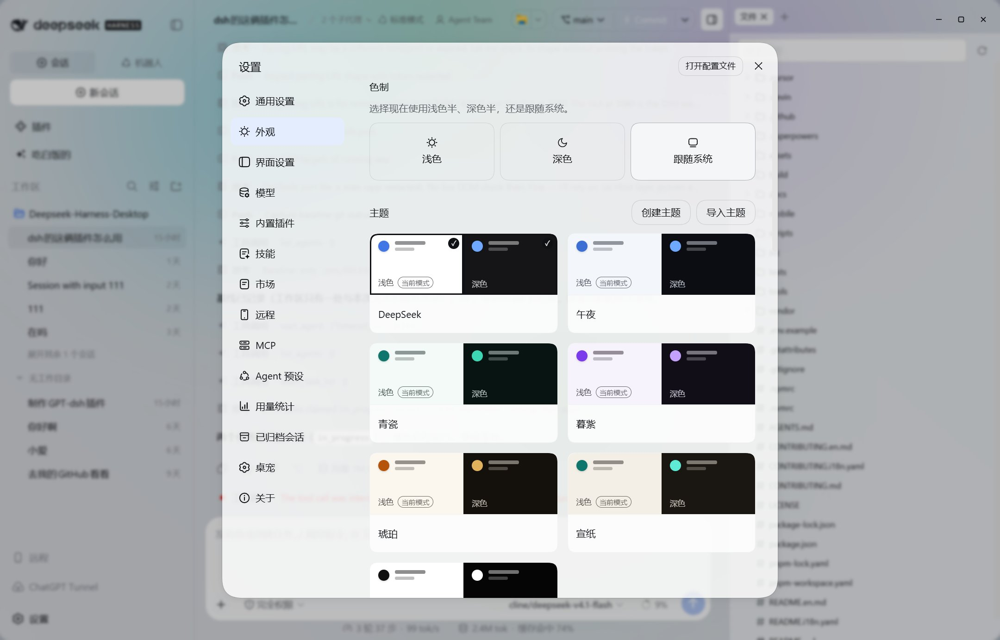
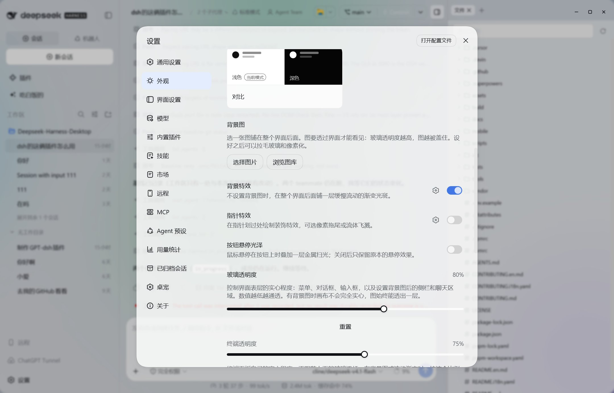

# Deepseek-Harness-Desktop

Desktop client based on the official DeepSeek Harness Web UI.

Themes, wallpapers, and other personalization options.

Download, install, and run — DSH is bundled.

[中文](README.md) · English · [Download](https://github.com/ChisaAlter/Deepseek-Harness-Desktop/releases/latest) · [DeepSeek Harness](https://github.com/deepseek-ai/deepseek-harness)

## Install

Grab a build from [Releases](https://github.com/ChisaAlter/Deepseek-Harness-Desktop/releases/latest). No local Node required.

| | |
| --- | --- |
| Windows x64 | `Deepseek-Harness-Desktop-Setup-*.exe` |
| macOS Apple Silicon | `Deepseek-Harness-Desktop-*-mac-arm64.dmg` |
| Intel Mac, Linux | [Run from source](#run-from-source) |

The macOS build is unsigned: right-click → Open, or run `xattr -cr /Applications/Deepseek-Harness-Desktop.app`.

## Features

- **Official UI** — Chat, tool calls, and approvals are `dsh web`. There is no custom chat page.
- **Git** — Switch branches, commit, push, and open a pull request from the title bar.
- **Files and terminal** — `Ctrl+\` opens the right column (Files / Diff / Browser / Agents); `` Ctrl+` `` opens the bottom terminal. A selection can join chat.
- **Models** — Thinking intensity for third-party models, vision fallback; the latest user message can be edited and resent.
- **Appearance** — Light / dark themes. Pick a wallpaper or Browse the gallery (categories, search, favorites; confirm crops to the window). Frost and pixelate stay on Appearance.
- **Extensions** — MCP, Skills, and plugins in Settings. The marketplace is the bundled [dsh-market](https://github.com/dsh-market/dsh-market) plugin (`dshmarket`). There is no standalone marketplace window.
- **Desktop** — Minimize to tray, auto-update. If Harness dies, the window returns to a failure page and restarts. If a user plugin blocks startup, the boot page can skip the plugin tree.

`Ctrl+,` opens Settings.

## Data directory

The desktop Harness **does not read** the official CLI `~/.dsh`. Sessions, settings, and marketplace plugins live in `dsh-home` under the app data directory:

| | |
| --- | --- |
| Windows | `%APPDATA%\Deepseek-Harness-Desktop\dsh-home` |
| macOS | `~/Library/Application Support/Deepseek-Harness-Desktop/dsh-home` |
| Plugins | `dsh-home/profiles/web` |

Workspace path and the shell API key stay in `config.json` / `credentials.json` one level up. Official `dsh` typed in the bottom terminal still uses `~/.dsh`.

<table>
  <tr>
    <td align="center" width="50%"></td>
    <td align="center" width="50%"></td>
  </tr>
  <tr>
    <td align="center" width="50%"></td>
    <td align="center" width="50%"></td>
  </tr>
</table>

## Run from source

Windows 10+ or macOS 14+ (Apple Silicon), Node 22.19+ / 24+, pnpm 11.

```powershell
git clone https://github.com/ChisaAlter/Deepseek-Harness-Desktop.git
cd Deepseek-Harness-Desktop
npm install
npm run setup:harness
npm start
```

The first `setup:harness` builds the vendored `vendor/deepseek-harness` — slow. Quit the installed app before a source launch; they share a single-instance lock.

## Development

Edit the UI in `vendor/deepseek-harness`. Follow the [design language](docs/design-language.en.md) and [motion](docs/motion.en.md). After changing client sources, run `pnpm run build:lib:client` there and restart the desktop app.

The current official baseline is `vendor/harness-upstream.json`: `0.1.1-rc.1` (`dsh-v0.1.1-rc.1` / `528c682e061696f5a160f363f236ecbf53cbd006`). The npx fallback is official `@deepseek-ai/dsh@0.1.1-rc.1` and does not include the titlebar, Git, surfaces column, or terminal drawer; those ship only on the source and packaged paths. SQLite session databases are incompatible with rc.7. The 0.2.7 installer follows this pin; do not describe the shipped 0.2.6 installer as rc.1.

```powershell
npm test              # desktop unit tests
npm run sync:harness -- --ref dsh-v0.1.1-rc.1 --sha 528c682e061696f5a160f363f236ecbf53cbd006
npm run dist          # Windows installer
npm run dist:mac      # macOS installer (must run on macOS)
```

Push a `v*` tag that matches `package.json`; GitHub Actions builds the Windows and macOS installers. Before publishing, walk the [production acceptance table](docs/qa/production-acceptance-test-cases.md) on the **CI windows artifact** (same SHA as the Setup you will upload). A local `npm run dist` must not count as Pass on that table.

## Community

Scan to join. Issues and PRs are welcome. Thanks to [Linux.do](https://linux.do).

## License

[MIT](LICENSE)
