# Deepseek-Harness-Desktop

[中文](README.md) · English

An Electron desktop shell on top of the official [DeepSeek Harness](https://github.com/deepseek-ai/deepseek-harness) Web UI.

No custom chat UI: Electron owns the window, tray, workspace, API key, and launch orchestration. Chat, tool calls, and approvals stay the official `dsh web`. A few desktop additions around third-party thinking intensity, a vision fallback model, themes, Git / terminal / surfaces, and MCP / Skills. Please use [v0.2.3](https://github.com/ChisaAlter/Deepseek-Harness-Desktop/releases/tag/v0.2.3). I just really like GUIs — issues, suggestions, and PRs are all welcome.

<p align="center">
  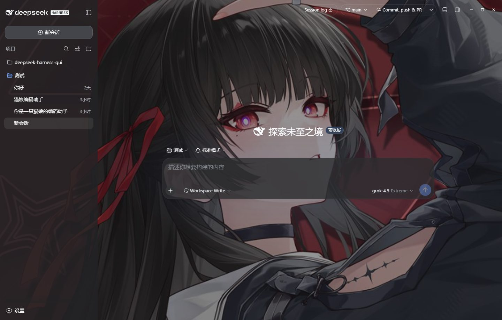
</p>

## Install

Grab a [v0.2.3](https://github.com/ChisaAlter/Deepseek-Harness-Desktop/releases/tag/v0.2.3) installer — no local Node required. Older builds: [Releases](https://github.com/ChisaAlter/Deepseek-Harness-Desktop/releases). Do not install the yanked v0.2.0.

- Windows x64: `Deepseek-Harness-Desktop-Setup-0.2.3.exe`
- macOS Apple Silicon (arm64): `Deepseek-Harness-Desktop-0.2.3-mac-arm64.dmg` (unsigned: right-click → Open, or run `xattr -cr /Applications/Deepseek-Harness-Desktop.app`)
- Intel Mac and Linux: run from source

## Interface

The title bar speaks Git: switch branches, Commit / Push / open a pull request when the workspace is a repo. `Ctrl+\` opens the right column (Files / Diff / Browser / Agents); Ctrl+` opens the bottom terminal. Files, Git, and commands stay inside the current workspace.

<p align="center">
  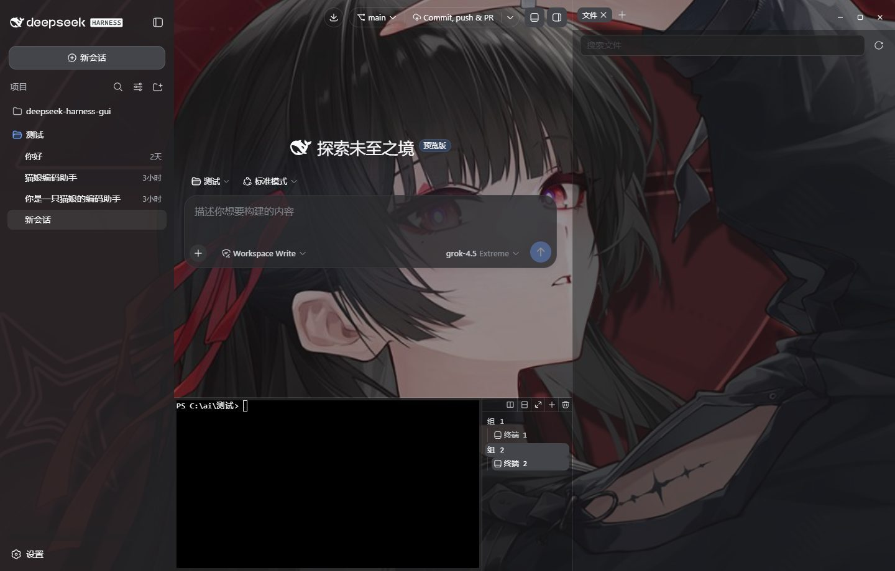
</p>

### Third-party thinking intensity

Settings → Model → edit a custom provider, then tick thinking intensity on the model. After save, the composer model menu shows Reasoning level.

<p align="center">
  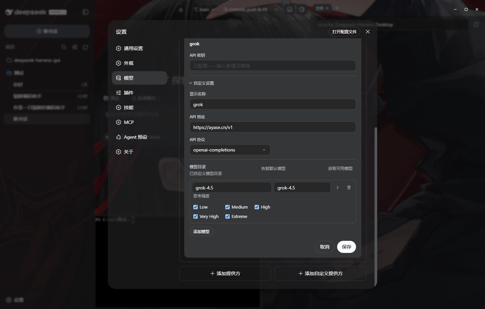
</p>

<p align="center">
  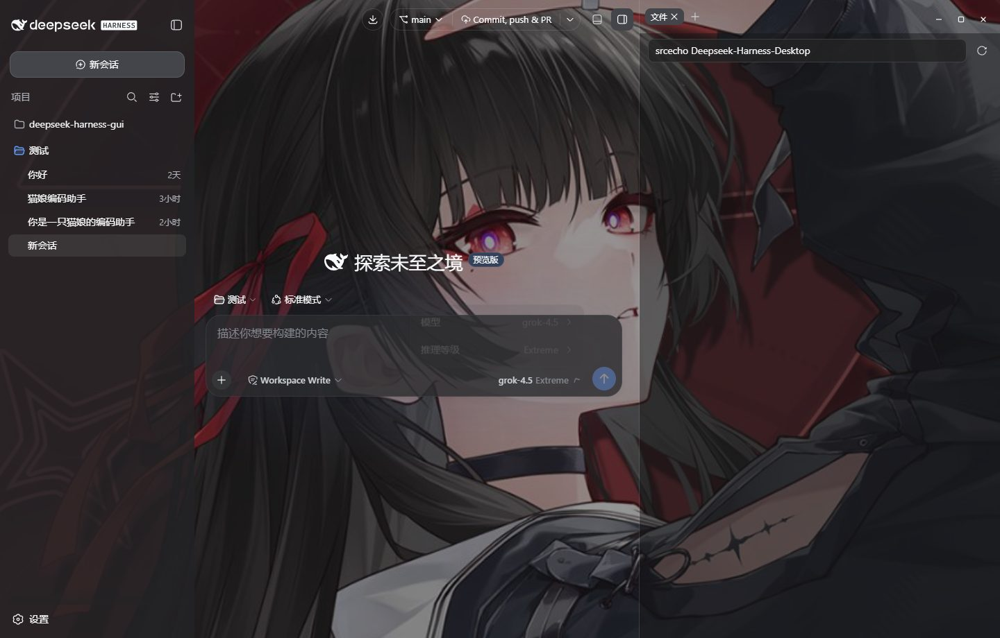
</p>

### Vision fallback model

Settings → Model → Vision model. Pick a model that accepts images. When the main model cannot see pictures, that model describes the image first, then the main model works from the description.

<p align="center">
  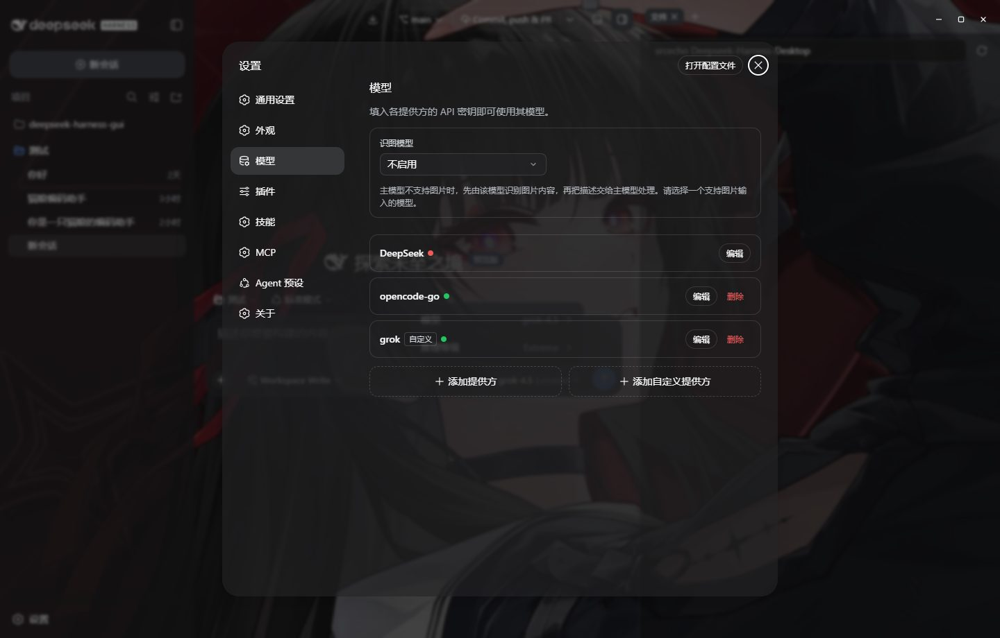
</p>

<p align="center">
  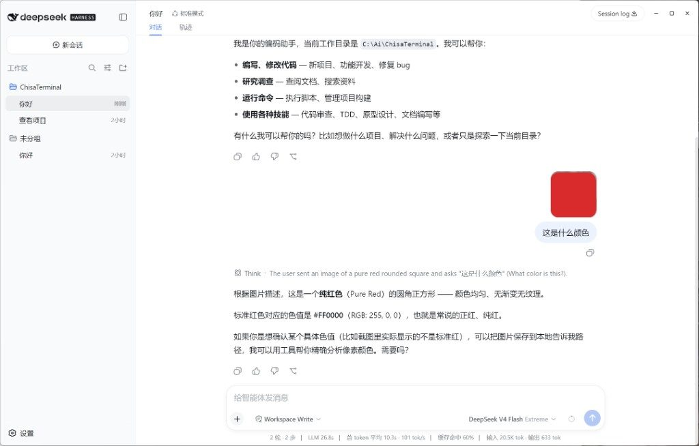
</p>

### Themes and wallpaper

Settings → Appearance. Light / Dark / System stay separate from the theme family; each card has a light half and a dark half — click the half you want. Create, duplicate, edit, import, and export custom families.

A wallpaper sits behind the whole UI. Once set, frost, pixelation, and glass opacity sliders appear: lower opacity makes the sidebar, dialogs, and composer more see-through.

<p align="center">
  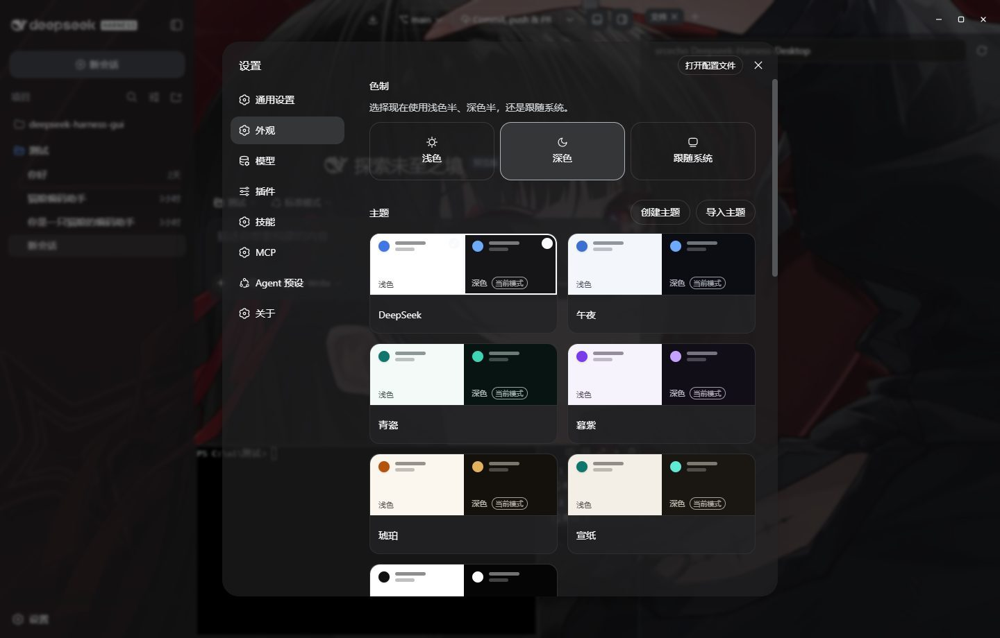
</p>

<p align="center">
  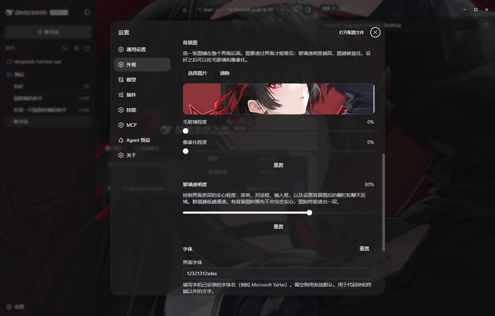
</p>

<p align="center">
  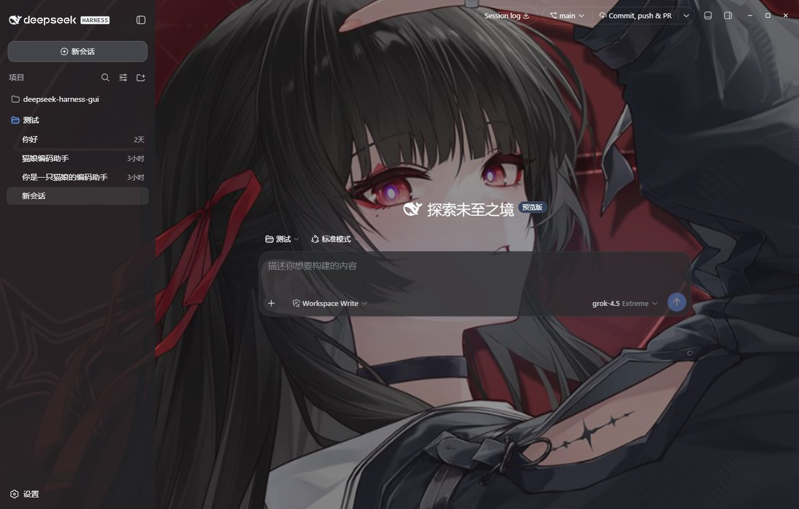
</p>

### MCP and Skills

Settings → MCP and Settings → Skills; File → MCP… / Skills… open the same pages. Add / edit / delete / enable. MCP writes `~/.dsh/mcp-servers.yaml`; skills write `~/.dsh/skills`. Changes apply immediately.

<p align="center">
  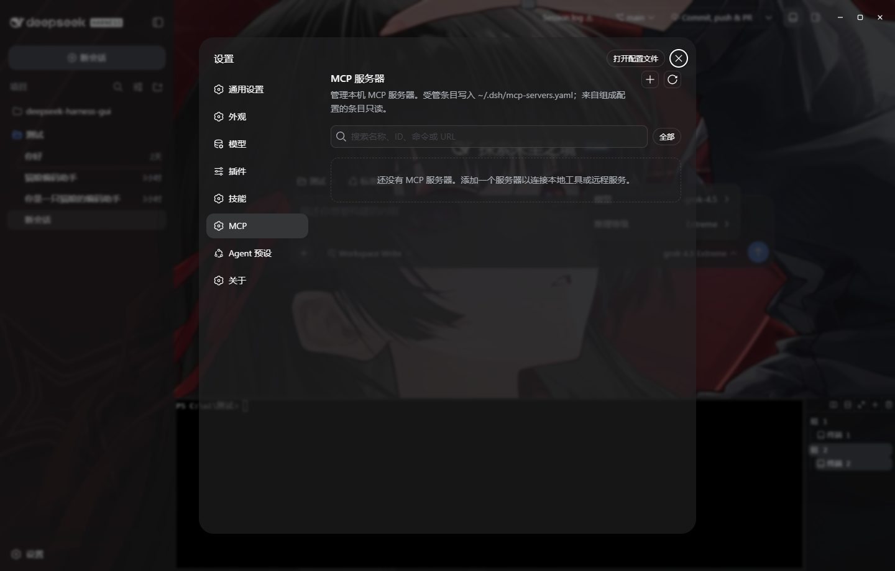
</p>

<p align="center">
  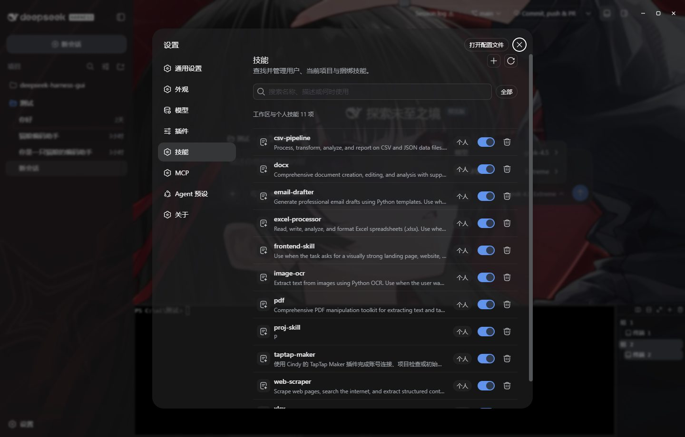
</p>

## Features

- **Frameless window with a custom title bar**: draggable, double-click to maximize; background follows the theme
- **Automatic Harness launch**: probes `127.0.0.1:3080`, kills leftover dsh processes, or hops to a free port
- **Three-stage launch chain**: bundled `vendor/deepseek-harness` build → local `dsh` → `npx @deepseek-ai/dsh`
- **Auto workspace registration**: registers the workspace directory into Harness over RPC at boot
- **Settings are Harness settings** (`Ctrl+,`): models, plugins, MCP, Skills, About, and update check live in the official panel
- **System tray**: show window, settings, restart Harness, quit. Settings → General chooses minimize-to-tray or quit
- **Auto-update**: an “Update available” button appears beside Settings; Settings → About still offers a manual check
- **API key stored separately**: `config.json` and `credentials.json` are split; the key is injected via `DEEPSEEK_API_KEY`
- **Plugin marketplace**: Settings → Plugins → Marketplace. Catalog is the GitHub [`dsh-plugin`](https://github.com/topics/dsh-plugin) topic. Install opens a blank session with a prefilled draft; uninstall stays one-click
- **Edit and resend**: a pencil on the latest user message; confirming sends from a child session, the parent stays put
- **Harness auto-recovery**: if `dsh` dies after the UI is up, the window returns to a failure page and retries a limited number of times
- **Full VT terminal**: the bottom drawer and the Terminal surface each own a PTY (Windows ConPTY); a selection can join chat

The phone-remote entry point is hidden in this release; capability and docs remain in [`mobile/README.md`](mobile/README.md).

## Shortcuts

| Action | How |
| --- | --- |
| Settings | `Ctrl+,` or tray menu |
| MCP | File → MCP…, or Settings → MCP |
| Skills | File → Skills…, or Settings → Skills |
| Plugin marketplace | Settings → Plugins → Marketplace; `Ctrl+Shift+M` |
| Terminal drawer | Ctrl+` or the title-bar terminal button |
| Right column | `Ctrl+\` or the title-bar surfaces button |
| Restart Harness | `Ctrl+Shift+R` |
| Reload UI | `Ctrl+R` |
| DevTools | `Ctrl+Shift+I` |

## Run from source

Windows 10+ or macOS 14+ (Apple Silicon), Node 22.19+ / 24+, pnpm 11.

```powershell
git clone https://github.com/ChisaAlter/Deepseek-Harness-Desktop.git
cd Deepseek-Harness-Desktop
npm install
npm run setup:harness
npm start
```

The Harness source ships with the repo (`vendor/deepseek-harness`); the first `setup:harness` installs dependencies and runs a full build — slow. After that, `npm start`. If Electron isn't found, point `ELECTRON_PATH` at `electron.exe`. The installed app and `npm start` share one `appId` and a single-instance lock: quit the installed app before a source launch.

After editing `packages/client/*/src`, run `pnpm run build:lib:client` in `vendor/deepseek-harness` (or at least rebuild that package's `lib/client.js`); rebuilding only `apps/web/dist` will not show layout or Settings changes. The desktop unit-test gate is `npm test`.

## How it's wired

Upstream lives in `vendor/deepseek-harness`; we boot the built `dsh web` (default `127.0.0.1:3080`). Once the service is reachable, the window loads the Web UI and registers the workspace.

Custom / third-party providers go through the pi-ai adapter. You can tick thinking intensity on a model and pick it in the composer. When the main model cannot see images, a dedicated vision model can describe the picture first. Appearance lives in the `ui-theme` section of `$DSH_HOME/settings.yaml`.

To change the UI, edit `vendor/deepseek-harness`, run `pnpm run build` there, then restart the desktop app. Harness is still a developer preview — expect it to move.

### Local development vs. upstream sync

`vendor/deepseek-harness` is a [git subtree](https://git-scm.com/book/en/v2/Git-Tools-Advanced-Merging#_subtree_merge):

- **Design language**: every UI / layout / frontend change must follow official `dsh web`. Spec: [docs/design-language.en.md](docs/design-language.en.md). Do not ship a second skin. The boot-page instrument look is documented under [Desktop boot page](docs/design-language.en.md#desktop-boot-page); do not spread it. Motion: [docs/motion.en.md](docs/motion.en.md).
- **Local changes**: edit files under `vendor/deepseek-harness` and commit them like any other code in this repo.
- **Pulling upstream updates**: `npm run sync:harness`. You only resolve conflicts where both sides touched the same lines. Rebuild with `npm run setup:harness` afterwards.

## Packaging & releases

```powershell
npm run dist      # Windows NSIS
npm run dist:mac  # macOS Apple Silicon DMG (must run on macOS)
```

Output lands in `dist/`. Shipping the vendored harness into the installer makes local builds slow; use GitHub Actions (`.github/workflows/release.yml`) instead. Pushing a `v*` tag (must match `package.json`) builds the Windows NSIS installer and the macOS arm64 DMG. A successful Windows build is enough to publish.

## WeChat group

<div>


Scan to join: tips, troubleshooting, and feature requests.

</div>

## Community acknowledgments

- [Linux.do](https://linux.do)

## License

[MIT](LICENSE)
