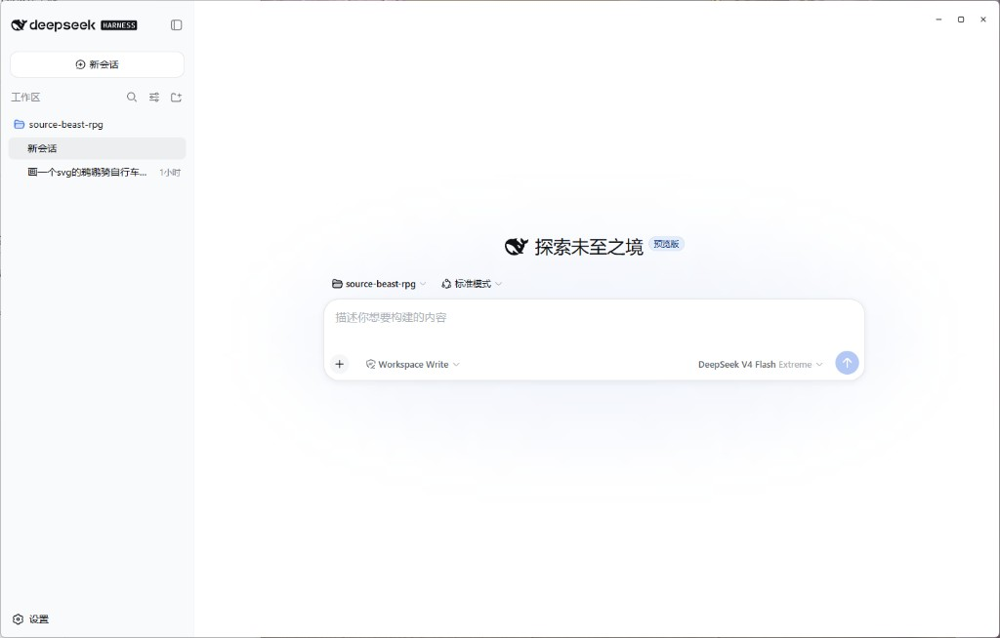

# Deepseek-Harness-Desktop

[中文](README.md) · English

An Electron desktop shell on top of the official [DeepSeek Harness](https://github.com/deepseek-ai/deepseek-harness) Web UI.

No custom chat UI: Electron owns the window, tray, workspace, API key, and launch orchestration. Chat, tool calls, and approvals stay the official `dsh web`. A few small tweaks around third-party thinking intensity and the like. I just really like GUIs — issues, suggestions, and PRs are all welcome.

<p align="center">
  
</p>

## WeChat group

<div align="center">


Scan to join: tips, troubleshooting, and feature requests.

</div>

## Features

- **Frameless window with a custom title bar**: draggable, double-click to maximize, working minimize / maximize / close buttons, background follows the theme
- **Automatic Harness launch**: probes `127.0.0.1:3080` on startup — kills leftover dsh processes from a previous run, or hops to a free port if something else is bound there
- **Three-stage launch chain**: bundled build in `vendor/deepseek-harness` → local `dsh` → `npx @deepseek-ai/dsh`; one of them will come up
- **Auto workspace registration**: registers the workspace directory into Harness over RPC at boot, no manual setup
- **Settings are Harness settings** (`Ctrl+,`): models, plugins, About, update check, and online install all live in the official settings panel
- **System tray**: show window, settings, restart Harness, quit
- **Auto-update**: Settings → About checks GitHub Releases and can install online
- **API key stored separately**: `config.json` and `credentials.json` are split; the key is injected into the dsh process via `DEEPSEEK_API_KEY`

## Run

Windows 10+, Node 22.19+ / 24+, pnpm 11. Get an API key from [DeepSeek](https://platform.deepseek.com/).

```powershell
git clone https://github.com/ChisaAlter/Deepseek-Harness-Desktop.git
cd Deepseek-Harness-Desktop
npm install
npm run setup:harness
npm start
```

First `setup:harness` clones and builds upstream — slow. After that, `npm start`. If Electron isn't found, point `ELECTRON_PATH` at `electron.exe`.

### Everyday usage

| Action | How |
| --- | --- |
| Settings | `Ctrl+,` or tray menu |
| Restart Harness | `Ctrl+Shift+R` |
| Reload UI | `Ctrl+R` |
| DevTools | `Ctrl+Shift+I` |
| Close window | Minimizes to tray by default (change in Settings) |

## How it's wired

Upstream lives in `vendor/deepseek-harness`; we boot the built `dsh web` (default `127.0.0.1:3080`). Launch order: integrated source build → local `dsh` → `npx`. Once the service is reachable, the window loads the Web UI and registers the workspace.

Custom / third-party providers go through the pi-ai adapter. You can tick thinking intensity on a model (low / medium / high / xhigh / max); that lands in `reasoningEfforts` and shows up in the composer. Official DeepSeek defaults are left alone.

To change the UI, edit `vendor/deepseek-harness`, run `pnpm run build` there, then restart the desktop app. Harness is still a developer preview — expect it to move.

### Local development vs. upstream sync

`vendor/deepseek-harness` is a [git subtree](https://git-scm.com/book/en/v2/Git-Tools-Advanced-Merging#_subtree_merge):

- **Local changes**: edit files under `vendor/deepseek-harness` and commit them like any other code in this repo — no patch files to maintain.
- **Pulling upstream updates**: `npm run sync:harness` (a `git subtree pull --squash` under the hood). Git performs a three-way merge, so upstream changes and local customizations combine automatically; you only resolve conflicts where both sides touched the same lines, then `git add` + `git commit`. Rebuild with `npm run setup:harness` afterwards.
- **Inspecting local customizations**: commits in `git log --oneline -- vendor/deepseek-harness` other than `Sync/Squashed` ones are the local development history; every upstream snapshot commit carries a `git-subtree-split` footer with the upstream commit SHA for comparison.

## Packaging & releases

Build locally:

```powershell
npm run dist
```

Output lands in `dist/`: an NSIS installer (`Deepseek-Harness-Desktop-Setup-x.y.z.exe`) plus a portable build. Packaging dereferences `vendor/deepseek-harness` into `resources/` and bundles a `node.exe`, so the installed app doesn't need a local Node. A full build requires the dsh artifacts (`apps/cli/lib/bin.js` + `apps/web/dist/index.html`).

### CI builds (recommended)

Shipping the ~1.4 GB vendored harness into the installer makes local builds slow. Use the GitHub Actions workflow (`.github/workflows/release.yml`) instead:

- **Manual build**: Actions page → Build Windows Installer → Run workflow; grab the installers from the artifacts
- **Auto release**: pushing a `v*` tag (e.g. `v0.1.0`) builds and publishes a GitHub Release automatically

Once a version is on GitHub Releases, the in-app update check picks it up.

## License

[MIT](LICENSE)
