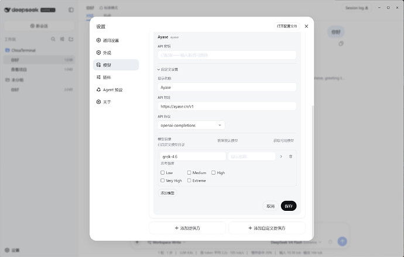
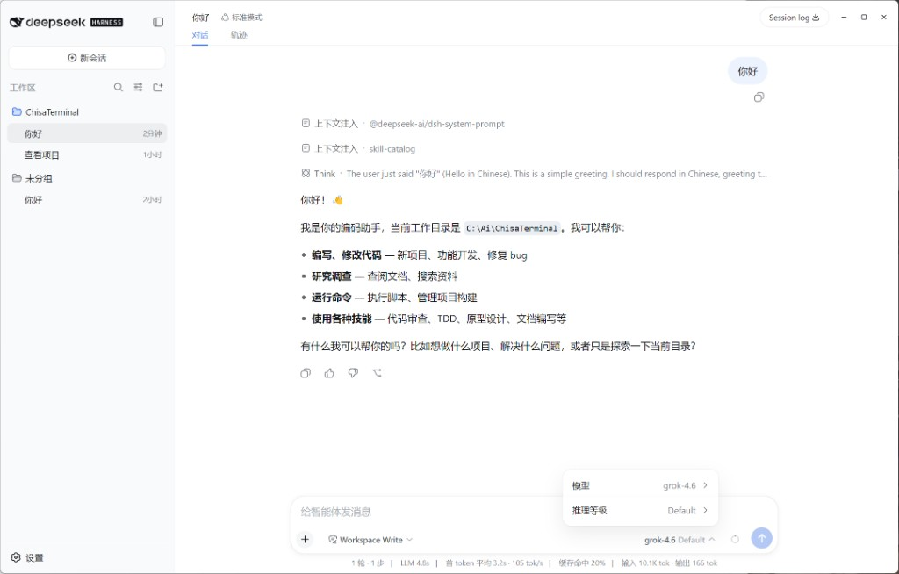
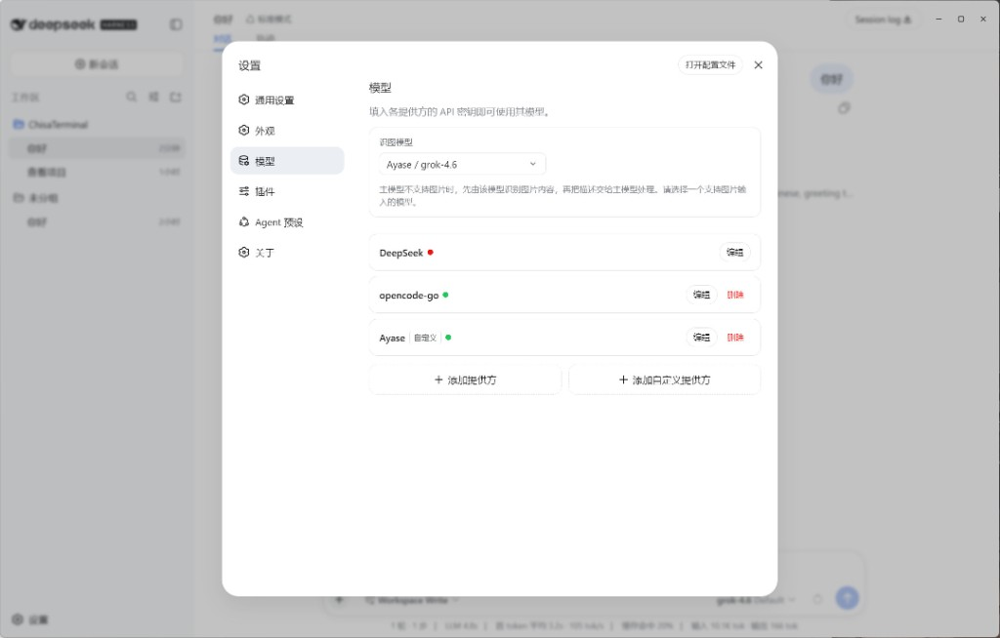
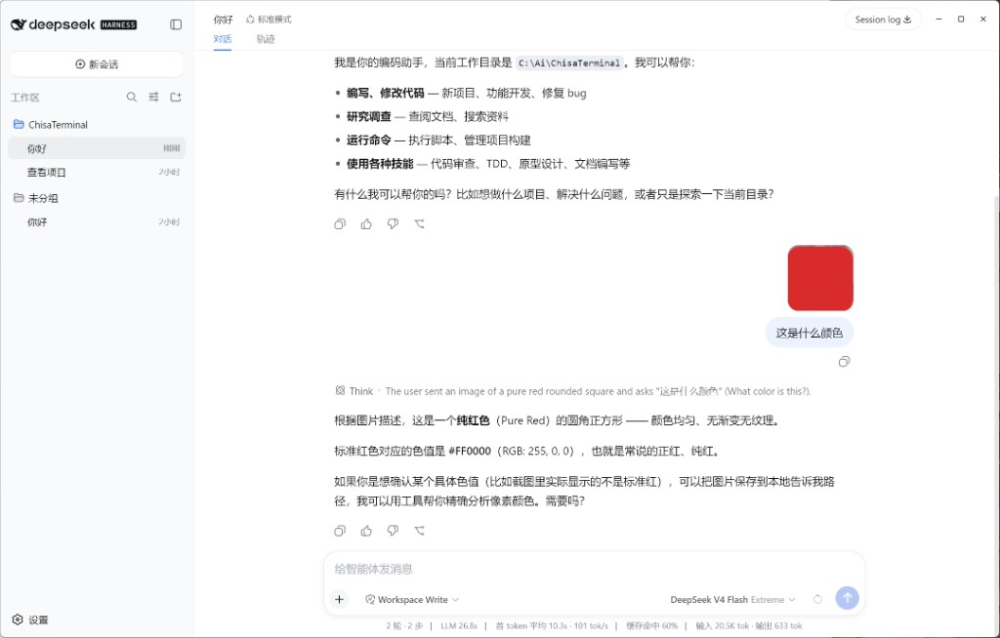

# Deepseek-Harness-Desktop

中文 · [English](README.en.md)

基于 [DeepSeek Harness](https://github.com/deepseek-ai/deepseek-harness) 官方 Web UI 的 Electron 桌面壳。

不重做聊天界面：Electron 只负责窗口、托盘、工作区、API Key 和启动编排，对话、工具调用、审批还是官方 `dsh web`。第三方思考强度、识图模型兜底这类地方补了一点。深度 GUI 爱好者，欢迎各种需求、建议和 PR。

<p align="center">
  
</p>


## 特性

- **无边框窗口 + 自绘标题栏**：可以拖动、双击最大化，最小化 / 最大化 / 关闭按钮齐全，标题栏背景跟随主题
- **自动启动 Harness**：启动时检测 `127.0.0.1:3080` 端口——杀掉上次残留的 dsh 进程；被其他程序占用就自动跳到空闲端口
- **三重启动链**：优先跑 `vendor/deepseek-harness` 构建产物 → 本机 `dsh` → `npx @deepseek-ai/dsh`，总有一条能起来
- **工作区自动注册**：启动时通过 RPC 把工作区目录注册进 Harness，不用手动建
- **设置就是 Harness 设置**（`Ctrl+,`）：模型、插件、关于、检测更新和在线安装都在官方设置里
- **托盘常驻**：显示窗口、设置、重启 Harness、退出
- **自动更新**：有新版本时设置按钮旁出现绿色"有新版本"按钮，点击即可在线更新；设置 → 关于里也可手动检查 GitHub Releases
- **API Key 独立存放**：`config.json` 与 `credentials.json` 分开，Key 通过 `DEEPSEEK_API_KEY` 注入 dsh 进程
- **第三方思考强度**：自定义 / 第三方模型可勾 Low / Medium / High / Very High / Extreme，输入栏里就能切推理等级
- **识图模型兜底**：主模型（比如 DeepSeek）不支持图片时，先由专门的识图模型看图，再把描述交给主模型

### 第三方思考强度

设置 → 模型 → 编辑自定义提供方，给模型勾上思考强度。保存后，输入栏的模型菜单会出现「推理等级」。

<p align="center">
  
</p>

<p align="center">
  
</p>

### 识图模型

设置 → 模型 → 识图模型，选一个支持图片输入的模型。主模型不能识图时，会先调用它识别图片内容，再把描述交给主模型。

<p align="center">
  
</p>

<p align="center">
  
</p>

## 安装

只想用的话，去 [Releases](https://github.com/ChisaAlter/Deepseek-Harness-Desktop/releases) 下载最新的 NSIS 安装包（`Deepseek-Harness-Desktop-Setup-x.y.z.exe`）或免安装的便携版，装完不需要本机 Node 环境。

目前只提供 Windows x64 安装包；macOS / Linux 请从源码运行，官方打包暂未提供。

## 从源码跑

Windows 10+，Node 22.19+ / 24+，pnpm 11。

```powershell
git clone https://github.com/ChisaAlter/Deepseek-Harness-Desktop.git
cd Deepseek-Harness-Desktop
npm install
npm run setup:harness
npm start
```

Harness 源码已随仓库自带（`vendor/deepseek-harness`），第一次 `setup:harness` 装依赖并完整构建，比较慢；之后 `npm start` 就行。本机没有 Electron 的话，把 `ELECTRON_PATH` 指到 `electron.exe`。

### 日常使用

| 操作 | 方式 |
| --- | --- |
| 设置 | `Ctrl+,` 或托盘菜单 |
| 重启 Harness | `Ctrl+Shift+R` |
| 重新加载界面 | `Ctrl+R` |
| 开发者工具 | `Ctrl+Shift+I` |
| 关闭窗口 | 默认最小化到托盘（可在设置里改） |

## 工作原理

官方源码固定在 `vendor/deepseek-harness`，启动时跑构建出来的 `dsh web`（默认 `127.0.0.1:3080`）。启动顺序：集成源码没构建好 → 退回本机 `dsh` → 再退回 `npx`。服务就绪后窗口加载 Web UI，并把工作区注册进去。

第三方 / 自定义供应商走 pi-ai 适配。模型上可以勾思考强度（low / medium / high / xhigh / max），写进 `reasoningEfforts`，输入栏里就能选。主模型不支持图片时，可指定识图模型先看图再交给主模型。官方默认体验基本不动，只在这类地方补了一点。

改界面就改 `vendor/deepseek-harness`，那个目录里 `pnpm run build`，再重启桌面端。Harness 还是开发者预览，随时可能变。

### 二次开发与上游同步

`vendor/deepseek-harness` 是 [git subtree](https://git-scm.com/book/en/v2/Git-Tools-Advanced-Merging#_subtree_merge)：

- **二次开发**：直接改 `vendor/deepseek-harness` 里的文件，和本仓库其他代码一起正常提交即可，不需要维护补丁文件。
- **拉取官方更新**：`npm run sync:harness`（等价于 `git subtree pull --squash`）。git 会做三方合并——上游改动和本地定制自动融合，只有双方改了同一处才需要手动解决冲突，解决后 `git add` + `git commit` 完成合并。同步后跑 `npm run setup:harness` 重新构建。
- **查看本地定制**：`git log --oneline -- vendor/deepseek-harness` 里非 `Sync/Squashed` 的提交就是二次开发历史；每次上游快照的提交信息里都带 `git-subtree-split`（上游 commit SHA），可用来对比。

## 打包与发布

本地打包：

```powershell
npm run dist
```

产物在 `dist/`：NSIS 安装包（`Deepseek-Harness-Desktop-Setup-x.y.z.exe`）+ 便携版。打包时会把 `vendor/deepseek-harness` 解引用复制进 `resources/`，并捆绑一个 `node.exe`——装完不依赖本机 Node 环境。安装包里的 Web UI 若想用官方 Web UI，需要 dsh 构建产物齐全（`apps/cli/lib/bin.js` + `apps/web/dist/index.html`）。

### CI 打包（推荐）

本地打包要把 1.4GB 的官方源码搬进安装包，很慢。用 GitHub Actions（`.github/workflows/release.yml`）在云端构建：

- **手动构建**：Actions 页 → Build Windows Installer → Run workflow，安装包在 artifacts 里下载
- **自动发布**：推送 `v*` 标签（如 `v0.1.0`）自动构建并发布 GitHub Release

发布到 GitHub Releases 后，应用内「检查更新」就能发现并下载新版本。

## 微信群

<div>


扫码进群，聊用法、踩坑和需求。

</div>

## 社区鸣谢

- [Linux.do](https://linux.do)

## 许可证

[MIT](LICENSE)
