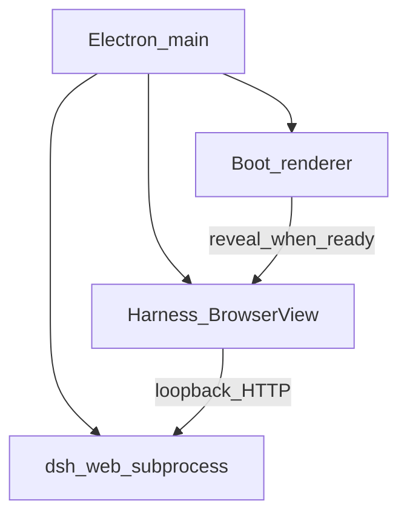

# 系统蓝图

Deepseek-Harness-Desktop 是 Electron 桌面壳：本机拉起官方 `dsh web`，用 `BrowserView` 嵌官方 Web UI。桌面独占能力（Git、PTY、工作区 FS、Browser 预览、市场安装、壁纸目录、托盘、更新、手机远程）经 `preload` → `window.shell` → `src/main/ipc.js` 桥接。

## 进程模型

| 角色 | 职责 |
| --- | --- |
| Electron main | 生命周期、窗口、IPC、子进程、托盘、更新、远程服务 |
| Boot renderer | 仅启动页（仪器画布）；日志、插件进度、失败恢复 UI |
| `dsh web` 子进程 | 官方 Harness HTTP（loopback）；对话 / 设置 / 客户端插件 |
| Harness BrowserView | 加载 loopback 官方页；注入标题栏等桌面 chrome；暴露 harness 角色的 `window.shell` |

单实例锁：安装版与源码启动互斥。打包态与源码态都走同一套壳，但 npx 官方包**不含**桌面标题栏 / Git / surfaces / 底栏终端——那些只在本仓库源码启动与安装包路径里。

## 冷启动到主界面（概要）

1. `src/main/index.js` 起应用，解析端口，构造 `HarnessController`。
2. 主窗口先载 boot 页；main 拉起 `dsh`（`dsh.js` / `DshManager`）。
3. Boot 订阅 `shell:state` / `shell:log` / `shell:plugin-boot`；插件装载进度留在启动画布。
4. Harness HTTP 就绪且客户端插件装完后，BrowserView 露出官方 UI；boot 退到后台覆盖逻辑之外。
5. 崩溃或 Harness 挂掉：可回故障态 / 自动重启倒计时（见 [flows/boot-to-ready.md](flows/boot-to-ready.md)、[modules/plugin-recovery.md](modules/plugin-recovery.md)）。

## 表面地图

| 表面 | 谁画 | 谁出能力 |
| --- | --- | --- |
| 启动页 | `src/renderer/boot.*` | main：状态、日志、恢复动作 |
| 四栏主框（侧栏 / 对话 / 右栏 Surfaces / 底栏终端） | Harness Web UI | 桌面 IPC：FS、Git、PTY、preview |
| 设置各 section | Harness `settings.section` 插件 | 市场安装、壁纸 catalog、跳转 IPC |
| 托盘 / 应用菜单 | main `tray.js` / `menu.js` | 打开设置、显示窗口、退出 |
| 手机 SPA | `mobile/web` | main `remote.js` / `mobile-web.js` 代理到 loopback harness |

视觉语言：除启动页仪器例外外，一律官方 `dsh web`（[design-language.md](../design-language.md)）。

## 状态归谁

| 状态 | 权威存储 |
| --- | --- |
| 主题、壁纸图、frost/pixelate、图源、收藏 | Harness Host `ui-theme` 设置（非桌面 `config.json`） |
| 工作区路径、关闭行为、远程配对等壳配置 | 桌面 `config.js` / 用户配置目录 |
| 会话、模型、MCP、技能 | Harness 侧（`$DSH_HOME` 等） |
| 市场目录缓存 / 安装进度 | main 市场模块 + 安装到 profile |
| PTY / preview 会话 | main 进程内，随窗口生命周期 |

## 安全边界（摘要）

- IPC 按 sender 角色区分 boot / harness（[modules/ipc-preload.md](modules/ipc-preload.md)）。
- 工作区路径受 `workspace-authority.js` 约束；FS / Git / 打开路径不得任意越权。
- Harness 与远程代理只认 loopback / 已配对通道（`local-url.js`、remote 鉴权）。

## 延伸阅读

- [modules/overview.md](modules/overview.md)
- [modules/boot-lifecycle.md](modules/boot-lifecycle.md)
- [appendix/shell-api.md](appendix/shell-api.md)
- 上游：[vendor/deepseek-harness/docs/architecture.md](../../vendor/deepseek-harness/docs/architecture.md)
