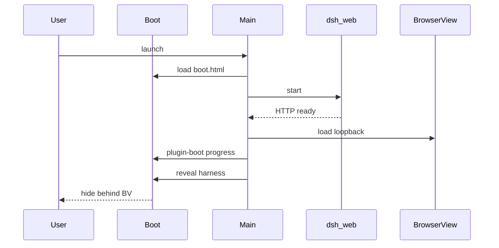

# 流程：冷启动到就绪

## 步骤

1. 用户启动应用（安装包或 `npm start`）。单实例锁：已有实例则聚焦已有窗口。
2. Main 创建窗口，加载 boot 页（`src/renderer/boot.html`）；preload 角色为 **boot**。
3. `HarnessController.start()`：起 `dsh web`、订端口、准备 BrowserView（尚可不露出）。
4. Boot UI 显示状态戳（BOOT）与等宽日志；订阅 `onState` / `onLog` / `onPluginBoot`。
5. Harness HTTP 起来后，客户端插件仍在后台 BrowserView 装载；状态行写「正在加载插件 n/m」，**不**切到官方「正在加载插件」页。
6. 插件装完且就绪：main 露出 BrowserView（官方四栏 UI）；preload 角色为 **harness**，注入 chrome。
7. 失败：boot 显示 ERROR / 重试 / 导出日志；用户插件弄挂时走跳过插件树（见 [plugin-recovery.md](plugin-recovery.md)）。

## 门槛

- QA：`TC-INST-001` … `TC-INST-004`，`TC-INST-003`（插件进度留在启动页）

## 入口

- `src/main/index.js`、`harness-controller.js`、`window.js`、`dsh.js`
- `src/renderer/boot.js`、`boot-recovery.js`
