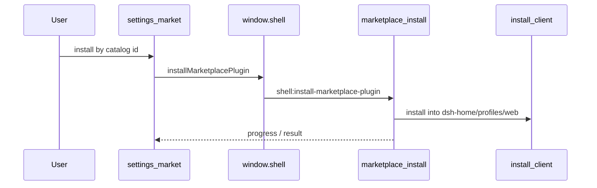

# 流程：市场安装插件

## 步骤

1. 用户打开设置 → **市场**（section id `market`）。无独立 Electron 市场窗；`openMarketplace` 在 Harness 就绪后跳到该 section。
2. 浏览 / 刷新目录（`listMarketplace` / `refreshMarketplace`）。
3. 按 catalog id 安装（`installMarketplacePlugin`）；进度经 `onPluginProgress`。
4. 安装走桌面 IPC → main `marketplace-install.js` / Host 安装客户端，落点 `userData/dsh-home/profiles/web`（不是 `~/.dsh`）；失败可弹 Modal，不静默吞。
5. 卸载：`uninstallPlugin`；与「装完在 Composer 里塞草稿」的旧路径无关。

## 门槛

- QA：`TC-EXT-001` … `TC-EXT-005`
- Feature card：`marketplace-settings`（[../features/marketplace-settings.md](../features/marketplace-settings.md)）

## 入口

- Main：`marketplace-install.js`、`marketplace-catalog.js`、`dshmarket-preset.js`、`desktop-install-control.js`
- UI：内置 `vendor/dshmarket` → settings section `market`
