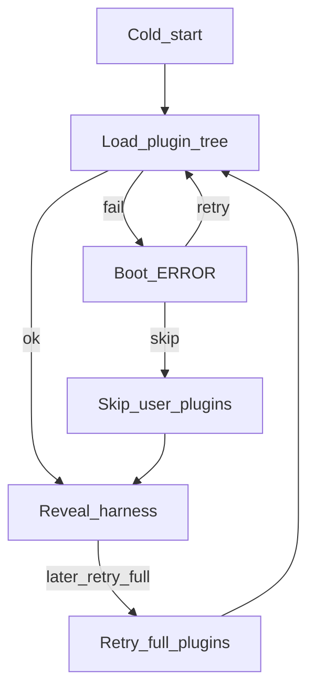

# 流程：插件启动恢复

## 步骤

1. 冷启动装用户插件树时失败（造障或真实坏插件）。
2. Boot 进入异常态：可重试、导出日志；提供**跳过用户插件树**继续启动。
3. 跳过成功后进入主界面（功能可能缺用户插件）；可再调「重试完整插件」`retryFullPlugins`。
4. Harness 运行中崩溃：可回故障页 + 自动重启倒计时；用户可取消倒计时。

## 门槛

- QA：`TC-INST-004` … `TC-INST-007`
- Feature card：`boot-page`（启动画布与恢复入口）+ 本章模块

## 入口

- `harness-controller.js`（pluginRecovery）、`plugin-tree-failure.js`、`plugin-recovery-actions.js`
- `src/renderer/boot-recovery.js`
