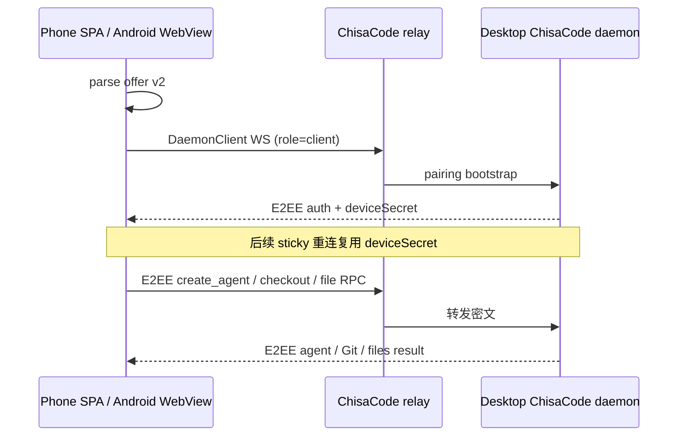

# 流程：手机远程配对

## 步骤

1. 设置 → 远程 → 网关选择局域网或外出；侧栏底部手机图标打开配对弹窗并开启远程。两种模式的协议相同，传输都经过配置的 ChisaCode 中继。
2. 桌面在本机 `:3180` 提供 `mobile/web` SPA，并生成包含 ChisaCode offer v2 的 `#offer=` 二维码。中继地址只在 offer 内用作传输端点，不充当页面地址。
3. 浏览器用系统相机、SPA 内扫码或粘贴完整链接；Android 原生扫码/粘贴后由 APK 内的同一份 SPA 在 `https://appassets.androidplatform.net` WebView origin 打开 offer。
4. SPA 用 `parseConnectionOfferFromUrl` 校验 offer，创建 `DaemonClient`，以 `role=client` 连中继，并用桌面 daemon 公钥建立端到端加密会话。首次配对用短期 pairing token 换取 `deviceSecret`；后续从稳定 origin 的 localStorage sticky 重连。
5. 配对后会话列表、时间线、发送、停止、审批和“新会话”都走 daemon RPC。“新会话”从已有 agent，或最近工作区 + ready provider，得到 `provider`/`cwd` 后调用 `createAgent`。
6. Git 状态、提交、拉取、推送、创建 PR、切换已有分支及根目录文件列表走 ChisaCode checkout/file RPC。协议没有普通分支创建和电脑窗口控制 RPC；对应按钮禁用并明确提示在电脑端操作。
7. offer 无效、重连、agent 目录、创建会话、Git、文件和桌面专属操作失败都必须显示在连接错误、banner 或 toast，不允许静默停留或抛到页面。
8. 手机侧复用官方语义色（Web `tokens.css` 中的 `--dsw-alias-*`），不嵌官方插件树，不用启动页 `--boot-*`。

## 门槛

- 自动门槛：`node --test "mobile/web/**/*.test.js"`、`src/main/chisacode-remote.test.js`、`mobile/web/chisacode/session.test.js`、`mobile/web/pair/scan.test.js`。
- Android：有 SDK 时运行 `mobile/android/gradlew test` 与 `assembleDebug`。
- 真机：中继已连接 → 扫码配对 → 手机新建会话 → Git/文件读取 → sticky 重连 → 桌面解除。云环境没有 Trent 的桌面/中继时必须记为 BLOCKED，浏览器静态预览不能替代真机结论。

## 入口

- `src/main/chisacode-remote.js`、`src/main/mobile-web-server.js`
- `mobile/web/chisacode/session.js`、`mobile/web/chisacode/parity.js`、`mobile/web/app.js`
- `mobile/android/`、`mobile/README.md`
