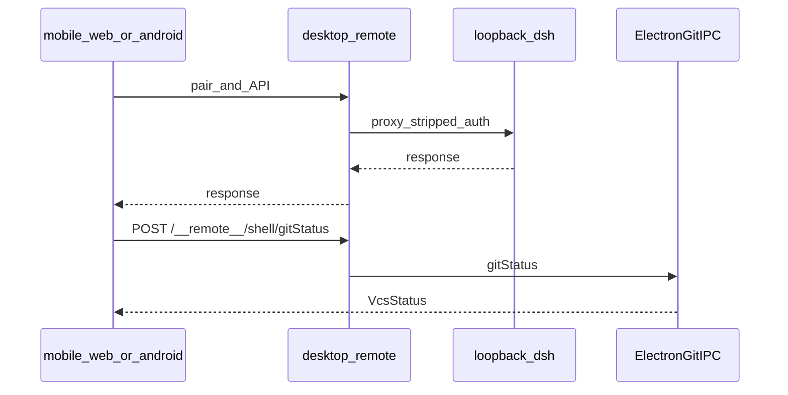

# 流程：手机远程配对

## 步骤

1. 侧栏底部手机图标打开远程弹窗，选择局域网或 HTTPS 中继并打开远程。
2. 手机打开配对页、系统相机扫码，或用 Android 安装包扫**同一条** `#offer=` 二维码。
3. Web：cookie 登录后 `mobile/web` SPA 经桌面远程服务代理 `/api/*` 等到本机 loopback harness。配对失败必须有文案：登录页 `#offer=` 自动登录失败（解不开 / 密钥被拒 / 网络断）落 `login-error` 行；SPA 启动遇到「带 offer 但无效」报「配对链接无效」，Cookie 试探仅对 401 静默，其他失败也报错——不允许静默停在「等待配对」。
4. Android：JSON 登录拿到设备令牌，Bearer 调 Host unary / WebSocket；Git / 列目录走 `/__remote__/shell/*`。
5. 手机侧复用官方语义色（Web `tokens.css` / Android `DshTokens`），不嵌官方插件树，不用启动页 `--boot-*`。

## 门槛

- 设计与手工路径见 mobile design / `mobile/README.md`；发版矩阵以当轮 QA 远程相关条为准（若表内有则跟表）。

## 入口

- `src/main/remote.js`、`remote-shell.js`、`mobile-web.js`、`relay-client.js`
- `mobile/web/`、`mobile/android/`、`mobile/README.md`
