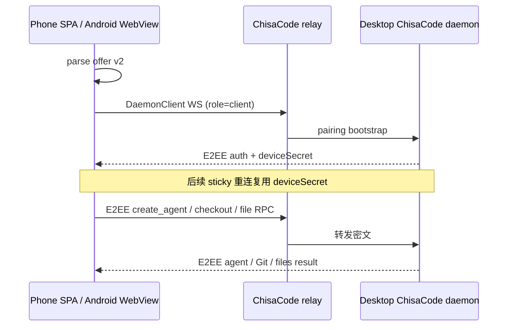

# 流程：手机远程配对

## 步骤

1. 设置 → 远程 → 网关选择局域网或外出；侧栏底部手机图标打开配对弹窗并开启远程。两种模式的协议相同，传输都经过配置的 ChisaCode 中继。
2. 桌面在本机 `:3180` 提供 `mobile/web` SPA，并生成包含 ChisaCode offer v2 的 `#offer=` 二维码。中继地址只在 offer 内用作传输端点，不充当页面地址。
3. 浏览器用系统相机、SPA 内扫码或粘贴完整链接；Android 原生扫码/粘贴后由 APK 内的同一份 SPA 在 `https://appassets.androidplatform.net` WebView origin 打开 offer。
4. SPA 用 `parseConnectionOfferFromUrl` 校验 offer，创建 `DaemonClient`，以 `role=client` 连中继，并用桌面 daemon 公钥建立端到端加密会话。首次配对用短期 pairing token 换取 `deviceSecret`；后续从稳定 origin 的 localStorage sticky 重连。
5. 配对后会话列表、时间线、发送、停止、审批和“新会话”都走 daemon RPC。“新会话”打开 chooser sheet：`fetchWorkspaces` 选工作区 → `getProvidersSnapshot(cwd)` 选 ready 提供方 → 可选权限模式，然后把 `workspaceId/cwd/provider(/modeId)` 显式传给 `createAgent`；不猜已有 agent 的 `provider/cwd`。
6. 会话权限模式来自 agent snapshot（`availableModes/currentModeId`）；切换调用 `setAgentMode`，失败回滚并显示 daemon 错误；`mode_changed` 流事件写回。模型同理：composer 模型 chip 显示 snapshot `model`，设置「模型」pane 用 `listProviderModels` 列清单、`setAgentModel` 切换（失败回滚）；新会话 chooser 在模式步之后可选模型并透传 `createAgent`。
6a. 会话目录走 `fetchAgents` 游标分页（抽屉底部「加载更多会话」）；行尾 ⋯ 菜单提供重命名/重新生成标题（`updateAgent`）、归档（`archiveAgent`）、删除（`deleteAgent`，确认对话框，daemon 失败可见且不乐观移除）。「已归档会话」sheet 走 `fetchAgentHistory(includeArchived)` 分页，「取消归档」调用 `refreshAgent`（重新载入会话，明示不会恢复运行中任务，不叫「恢复」）。子智能体（`relation.kind==='subagent'`）折叠在父会话下、打开为只读；时间线支持「加载更早消息」向上分页（seq 去重 + 滚动锚点保持），助手消息经注入安全的结构化 Markdown 渲染，工具卡带 detail 摘要/详情，todo/压缩/turn_changes/未知类型都有可见 fallback；审批按 daemon `actions` 列表原样渲染（无 actions 才用通用允许/拒绝），`permission_resolved` 跨端清除；`/` 开头触发 `listCommands` 斜杠命令弹层。
7. SPA 经 `chisacode/controller.js` 订阅 `subscribeConnectionStatus`：断线/重连中在 chat 顶部连接条明示，断线时发送被可见拒绝、草稿按 serverId+sessionId 留在 localStorage；client 自动重连回到 connected 后执行权威 resync（`fetchAgents` + 当前会话 timeline 尾页），失败进 banner。
8. Git 状态、提交、拉取、推送、创建 PR、切换已有分支及根目录文件列表走 ChisaCode checkout/file RPC。协议没有普通分支创建和电脑窗口控制 RPC；对应按钮禁用并明确提示在电脑端操作。
9. offer 无效、重连、agent 目录、创建会话、Git、文件和桌面专属操作失败都必须显示在连接错误、banner 或 toast，不允许静默停留或抛到页面。
10. 手机侧复用官方语义色（Web `tokens.css` 中的 `--dsw-alias-*`），不嵌官方插件树，不用启动页 `--boot-*`。

## 门槛

- 自动门槛：`node --test "mobile/web/**/*.test.js"`、`src/main/chisacode-remote.test.js`、`mobile/web/chisacode/session.test.js`、`mobile/web/pair/scan.test.js`。
- 浏览器集成：`node tools/mobile-web-qa/run-qa.mjs`（fake DaemonClient + 真实 SPA 栈，需 `npm i --no-save puppeteer-core` 与本机 Chrome）。
- Android：有 SDK 时运行 `mobile/android/gradlew test` 与 `assembleDebug`。
- 真机：中继已连接 → 扫码配对 → 手机新建会话 → Git/文件读取 → sticky 重连 → 桌面解除。云环境没有 Trent 的桌面/中继时必须记为 BLOCKED，浏览器静态预览不能替代真机结论。

## 入口

- `src/main/chisacode-remote.js`、`src/main/mobile-web-server.js`
- `mobile/web/chisacode/session.js`、`mobile/web/chisacode/parity.js`、`mobile/web/chisacode/controller.js`、`mobile/web/app.js`
- `mobile/web/chisacode/directory.js`（目录分页/生命周期）、`timeline.js`（向上分页）、`approvals.js`（审批 actions）、`commands.js`（斜杠命令）、`mobile/web/conversation/markdown.js`（安全 Markdown）
- `tools/mobile-web-qa/`（fake-daemon 浏览器集成 harness）
- `mobile/android/`、`mobile/README.md`
