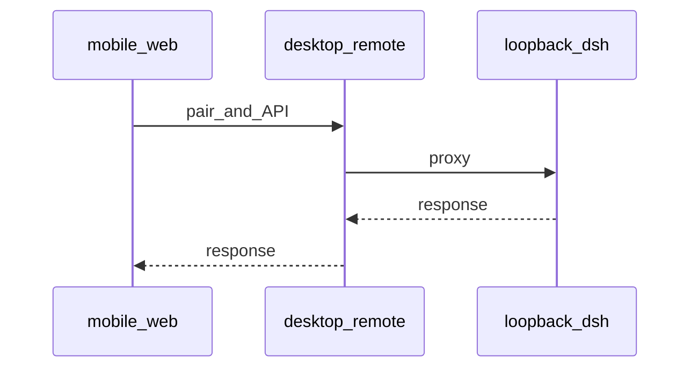

# 流程：手机远程配对

## 步骤

1. 侧栏底部手机图标打开远程弹窗，选择局域网或 HTTPS 中继并打开远程。
2. 手机打开配对页或扫码；完成鉴权后拿到会话。
3. `mobile/web` SPA 经桌面远程服务代理 `/api/*` 等到本机 loopback harness。
4. 手机侧复用官方语义色（`mobile/web/tokens.css` 抄 `--dsw-alias-*`），不嵌官方插件树，不用启动页 `--boot-*`。

## 门槛

- 设计与手工路径见 mobile design / `mobile/README.md`；发版矩阵以当轮 QA 远程相关条为准（若表内有则跟表）。

## 入口

- `src/main/remote.js`、`mobile-web.js`、`relay-client.js`
- `mobile/web/`、`mobile/README.md`
