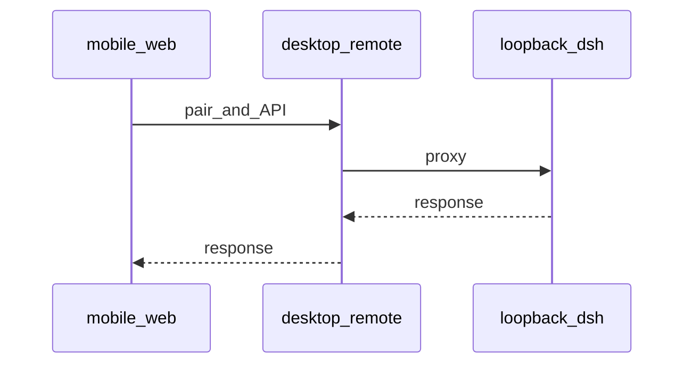

# 流程：手机远程配对

当前产品状态为**停放**：侧栏无入口，网关不监听。下列步骤只在重新打开 `REMOTE_FEATURE_ENABLED` 并把 Feature 卡改回 `active` 之后才是用户路径。

## 步骤

1. 侧栏底部手机图标打开远程弹窗，选择局域网或 HTTPS 中继并打开远程。
2. 手机打开配对页或扫码；完成鉴权后拿到会话。
3. `mobile/web` SPA 经桌面远程服务代理 `/api/*` 等到本机 loopback harness。
4. 手机侧复用官方语义色（`mobile/web/tokens.css` 抄 `--dsw-alias-*`），不嵌官方插件树，不用启动页 `--boot-*`。

## 门槛

- 停放时验收走 [TC-NEG-001](../../qa/production-acceptance-test-cases.md)；TC-REM-001…003 为 N/A。
- 重新打开后的设计与手工路径见 mobile design / `mobile/README.md`。

## 入口

- `src/main/config.js` `REMOTE_FEATURE_ENABLED`、`src/preload/index.js`
- `src/main/remote.js`、`mobile-web.js`、`relay-client.js`
- `mobile/web/`、`mobile/README.md`
